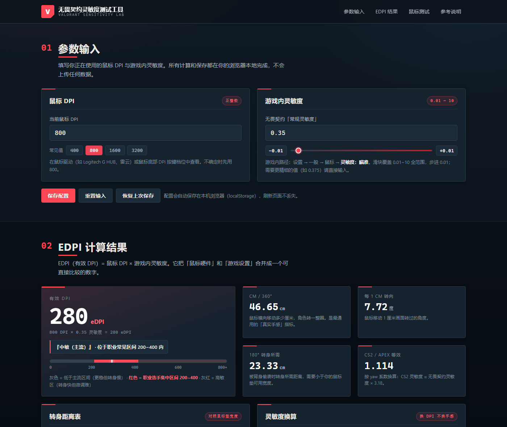
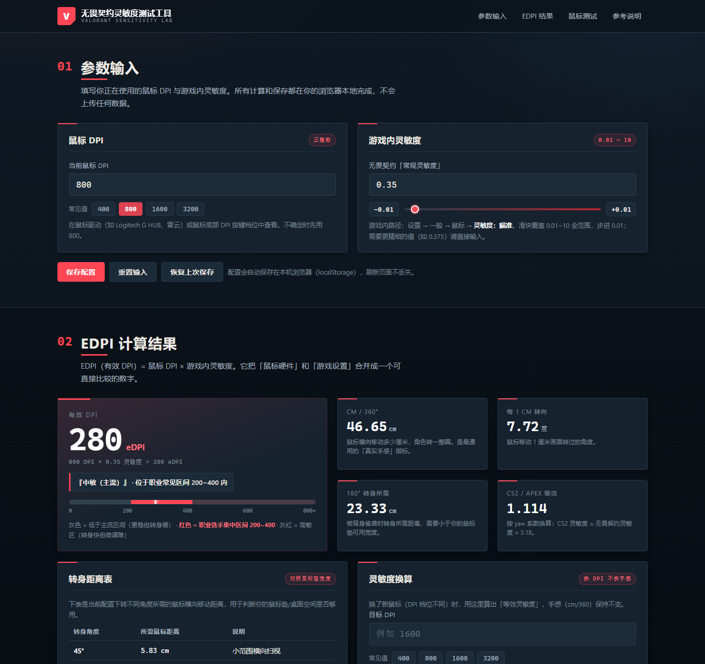

# 无畏契约灵敏度测试工具


**把「凭感觉调灵敏度」变成一套有流程、有数据、有结论的测试。**

一个帮助无畏契约（VALORANT）玩家找到合适鼠标灵敏度的网页工具。核心参数只有两个：
**鼠标 DPI** 与 **游戏内灵敏度**。

纯前端静态站点 —— **零后端、零数据库、零第三方依赖、零外部请求（可完全离线运行）**，
不需要任何构建步骤，克隆下来双击 `index.html` 就能用。

## 🌐 在线使用：**[https://www.kang.love/](https://www.kang.love/)**

<table>
  <tr>
    <td width="50%"></td>
    <td width="50%"></td>
  </tr>
  <tr>
    <td align="center"><sub>参数输入与实时计算（EDPI / cm360 / 转身距离 / 换算）</sub></td>
    <td align="center"><sub>灵敏度匹配测试入口 + 程序化 3D 测试画布</sub></td>
  </tr>
</table>

---

## 它解决什么问题

网上的灵敏度教学通常停在「多试几个值」。但实际调参时你会卡在三个具体问题上：

| 你的困境 | 这个工具的答案 |
| --- | --- |
| 「800 DPI × 0.35」和「1600 DPI × 0.175」到底哪个快？ | **EDPI = DPI × 灵敏度**，把两套设置压成一个可直接比较的数字 |
| 「快」和「慢」到底是多少？我的鼠标垫够用吗？ | **cm/360**：转一圈需要在垫子上移动多少厘米 —— 唯一能和鼠标垫宽度直接对比的指标 |
| 试了 5 个值，怎么知道哪个更适合我？ | **灵敏度匹配测试**：在多个候选档位跑同一套挑战，按成绩给出推荐值 |

---

## 功能

| 模块 | 内容 |
| --- | --- |
| **EDPI 实时计算** | `EDPI = DPI × 灵敏度`，并给出 cm/360、每厘米转向角度、90°/180°/360° 转身所需距离、CS2/Apex 等效灵敏度、eDPI 区间刻度条 |
| **灵敏度换算** | 换 DPI 时算出等效游戏内灵敏度，一键套用，手感（cm/360）完全不变 |
| **灵敏度匹配测试** | 全屏引导式流程：多个候选档位 ×（甩枪定位 + 跟枪）→ 四项指标加权评分 → **给出一个匹配你的灵敏度** + 成绩表 + 结论可信度，支持 ±10% 精测收敛、一键应用与复制结果 |
| **测试画布** | 程序化 3D 靶场，用鼠标**原始输入**驱动视角；**上下左右自由观察**（水平无限圈 / 垂直 ±85°）；手动模式：自由转向 / 360° 校准 / 定位测试 |
| **参考数据** | 职业选手 eDPI 参考值（带日期与来源）、eDPI 区间参考表、EDPI 与 cm/360 知识说明、FAQ |
| **本地保存** | 配置自动存入浏览器 `localStorage`，刷新不丢失 |

---

## 灵敏度匹配测试：它凭什么给出推荐

这是本项目的核心，也是最花心思的部分。要让「推荐的灵敏度」有意义，测试本身必须公平：

- **同题同卷** —— 所有候选档位使用**同一组甩枪偏移序列**与**同一段跟枪波形**，
  挑战完全一致，差异只可能来自灵敏度本身
- **热身丢弃** —— 第一轮成绩不计分，避免把「刚开始手生」的进步误判成「这档更好」
- **乱序测试** —— 候选顺序随机打乱，避免「越测越熟练 → 最后测的档位占便宜」
- **鼠标垫约束** —— 填了垫子宽度后，「转身 180° 需要超过垫子宽度」的档位直接排除：
  那种设置物理上不可用，测了也没意义
- **中断即作废** —— 按 `Esc`、退出全屏、切走标签页都会作废当前档位并暂停，不用半截数据充数
- **诚实结论** —— 分差未超过噪声阈值、或最佳档位命中样本不足时，直接告诉你
  **「没有哪一档显著更好，建议保留当前值」**，而不是硬推一个「最优解」

测试难度也是设计过的：靶位固定在**视野内**（水平 12°~30°、垂直 ±8°），既够远能测出真实
甩枪幅度，又不会跑到屏幕外逼你盲拖；命中判定用**球面角距离**而不是屏幕像素，
因此与分辨率、窗口大小、是否全屏完全无关。

---

## 计算公式

| 公式 | 表达式 | 示例（800 DPI × 0.35） |
| --- | --- | --- |
| **EDPI** | `DPI × 游戏内灵敏度` | **280** |
| 每 count 旋转角度 | `0.07 × 灵敏度`（无畏契约引擎 yaw 系数） | 0.0245° |
| **cm/360** | `(360 × 2.54) ÷ (DPI × 灵敏度 × 0.07)` | **46.65 cm** |
| 每厘米转向角度 | `(0.07 × DPI × 灵敏度) ÷ 2.54` | 7.72° |
| 转身 N° 所需距离 | `(N × 2.54) ÷ (DPI × 灵敏度 × 0.07)` | 180° → 23.33 cm |
| 换 DPI 的等效灵敏度 | `DPI₁ × S₁ ÷ DPI₂` | 换 1600 DPI → **0.175** |
| CS2 / Apex 等效 | `灵敏度 × 0.07 ÷ 0.022`（≈ × 3.1818） | 1.114 |

**推导**：1 个鼠标 count 让视角旋转 `0.07 × 灵敏度` 度 → 转一圈需要
`360 ÷ (0.07 × 灵敏度)` 个 count → 换算成厘米再除以 DPI，即得上表。

公式已与公开换算器的锚点值交叉核对：`280 eDPI → 46.7 cm`、`160 eDPI → 81.6 cm`、
`400 eDPI → 32.7 cm`、`100 eDPI → 130.6 cm`，全部一致。

---

## 怎么用

1. **填鼠标 DPI**：在鼠标驱动里查看，不确定就用「反推法」——
   把游戏内灵敏度设成 `1.000`，在靶场转满一圈，量出鼠标移动的厘米数 `L`，
   则 `DPI ≈ 13062.86 ÷ L`
2. **填游戏内灵敏度**：游戏内路径为 设置 → 一般 → 鼠标 → **灵敏度：瞄准**
3. **读结果**：EDPI、cm/360、180° 转身距离。**先看 180° 那一栏，再看你的鼠标垫** ——
   如果 180° 需要的距离接近垫子宽度，你每次转身都要抬鼠标，这时候应该提高灵敏度
4. **跑一次匹配测试**（推荐）：在第 03 区选测试强度、填鼠标垫宽度，点「开始测试」，
   跟着倒计时打完几档，看报告给出的推荐值
5. **改完至少实战 3 小时**再用它做判断 —— 在那之前你感受到的只是「陌生感」

> 建议先关掉 Windows 的「提高指针精确度」（鼠标属性 → 指针选项），让鼠标输入保持 1:1。
> 手机/平板能用参数计算，但转向测试需要鼠标的物理位移，页面会提示改用电脑。

---

## 项目结构

```
valorant-sens-tool/
├── index.html          # 唯一页面
├── css/style.css       # 手写样式（无 Tailwind / 无 CDN）
├── js/
│   ├── calc.js         # 纯计算：EDPI / cm360 / 校验（可被 Node 直接测试）
│   ├── canvas.js       # 测试画布：3D 投影渲染 + 鼠标采样 + 甩枪/跟枪 drill
│   ├── testflow.js     # 测试流程：引导、评分、推荐
│   ├── storage.js      # localStorage 封装（含无痕模式降级）
│   ├── data.js         # 参考数据（职业选手值 / 区间文案）
│   └── main.js         # UI 装配
├── images/             # README 截图（部署时可选：若想让 og:image 分享缩略图生效，
│                       #   需要一并上传到站点；只传 html/css/js 也不影响功能）
└── tools/              # 开发期测试脚本（部署时不需要）
```

**部署只要 `index.html` + `css/` + `js/`** —— 8 个文件，实测 251.8 KB，gzip 后约 81.3 KB。

### 本地运行

```bash
git clone https://github.com/<你的用户名>/valorant-sens-tool.git
cd valorant-sens-tool
# 双击 index.html；或起一个本地服务（与线上环境一致）
python -m http.server 8080     # → http://localhost:8080/
```

---

## 开发与测试

需要 Node.js 14+（**仅开发期需要**，部署不需要）：

```bash
node tools/test-calc.js     # 计算模块单元测试：74 项断言
node tools/test-flow.js     # 测试流程与评分单元测试：37 项断言
node tools/check-site.js    # 静态自检：文件引用、元素 id、脚本顺序、外链、CSS 不变式
node tools/e2e/run.js       # 浏览器端到端测试：140 项断言（需本机有 Chrome/Edge）
```

端到端测试会起一个本地静态服务器 + 无头浏览器，用**合成鼠标事件**真实操作页面，
其中几条专门用来抓「靠肉眼很难发现」的问题：

- 拖动鼠标 1000 counts → 画面转向 **24.5°**、鼠标位移 **3.18 cm**（公式精确值）
- 垂直输入 500 counts → 俯仰 **-12.25°**；大幅低头被夹紧在 **-85°**（画面不翻转）
- **渲染与命中判定的一致性**：读取靶面在屏幕上的像素位置换算成夹角 →
  夹角 22° 时点击**必须 miss**；再用像素反馈闭环把准星移到靶心（收敛到 0.48°）→
  点击**必须 hit**。这类「画面画在 A 点、判定却按 B 点算」的静默错位，
  靠命中率测试根本发现不了
- **完整跑完一轮测试流程**（140+ 次合成事件驱动），校验成绩表数值有效、推荐值合法、
  应用推荐后输入框与结果区同步
- 刷新页面后配置从 `localStorage` 正确恢复；全程无 JS 报错

当前状态：**74 + 37 + 140 = 251 项断言全部通过**。

---

## 实现要点

**为什么必须用真正的三维投影。** 画布支持上下左右自由观察（垂直 ±85°）。
若沿用「屏幕 x 由水平角决定、y 由地平线偏移决定」的小角度近似，只要俯仰不为 0，
**画面上看到的靶心就会和命中判定用的角度对不上 —— 玩家瞄准了靶心却判 miss**。
这种错位对所有灵敏度一致地偏，用命中率测试发现不了，所以现在用完整的
yaw + pitch 相机变换与透视除法，让渲染与判定共用同一套数学。

**评分公式。** 四项指标 min-max 归一化后加权（只在本次会话的各档之间比较）：

| 指标 | 权重 | 方向 |
| --- | --- | --- |
| 甩枪命中率 | 30% | 越高越好 |
| 甩枪速度 | 25% | 越快越好（一个都没命中按 2000ms 计，即最差） |
| 路径效率 | 20% | 实际角路程越接近理想路程越好（衡量「冲过头再拉回来」） |
| 跟枪稳定性 | 25% | 准星落在靶面内的时间占比 |

各档完全相同或指标缺失时给**中性分**（而不是最高分或最低分），避免制造虚假差异。

**几个踩过的坑**（都留下了回归断言）：

| 现象 | 根因 |
| --- | --- |
| 全屏后屏幕变暗、面板不退出、点不了靶 | 全屏规则 `.canvas-wrap:fullscreen .flow-panel{display:grid}` 特异性压过 `.flow-panel[hidden]{display:none}`，而浏览器默认的 `[hidden]` 属于 UA 样式、优先级低于任何作者样式 → 面板的 `hidden` 完全失效，一块 90% 不透明遮罩永久盖住整屏。修法：全局 `[hidden]{display:none!important}` |
| 全屏瞬间黑屏 | 改画布尺寸会清空缓冲区，那一帧不补画就是黑屏。修法：尺寸重建后立刻补画一帧 |
| 全屏下掉帧 | 每帧新建上百个渐变对象 + 2K/4K 下缓冲区过大。修法：渐变改纯色/缓存 + 缓冲像素预算 |
| 路径效率列恒为占位符 | 未初始化 `totalPathDeg` 导致该指标恒为 `NaN` —— 占 20% 权重的**静默失效** |

**性能与体积。** 全部手写、无依赖，8 个文件 gzip 后约 81 KB；画布每帧只做必要的路径绘制，
不带任何图片资源（地面网格、后墙、靶位、准星全部用 Canvas 2D 实时绘制）。

---

## 浏览器支持

| 浏览器 | 状态 |
| --- | --- |
| Chrome / Edge（Chromium 90+） | ✅ 完整支持（推荐）：全屏 + 指针锁定 + 原始输入 |
| Firefox 90+ | ✅ 支持（`unadjustedMovement` 视版本而定，无则自动回退） |
| Safari 15.4+ | ✅ 基本支持（全屏 API 已做 `webkit` 兼容） |
| 移动端浏览器 | ⚠️ 参数计算可用；转向测试无法还原鼠标物理位移，页面会提示改用电脑 |

---

## 隐私

- 无后端接口，**不上传任何用户数据**
- 无第三方统计、无广告、无外部字体与图片 CDN，**可在完全离线的内网使用**
- 配置仅保存在你自己浏览器的 `localStorage`（键名 `valorant-sens-tool:v1`）
- 唯一的权限请求是 Pointer Lock（鼠标锁定），按 `Esc` 随时解除

---

## 免责声明

本工具为玩家自制的**非官方**工具，与 Riot Games 无任何关联。
VALORANT 及相关名称、标识为 Riot Games, Inc. 的商标或注册商标。

换算系数（yaw = 0.07 / count）与职业选手参考值来自公开资料汇总，
仅用于帮助玩家建立量级概念，不构成任何「最佳配置」的建议。

## 许可证

`MIT License`
